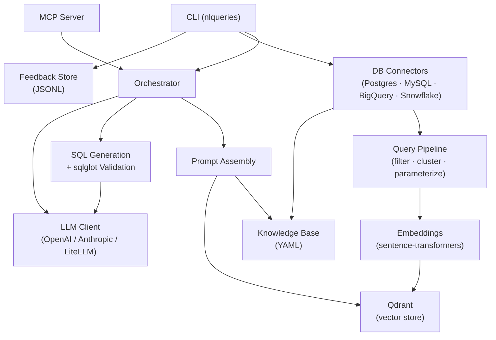

# nlqueries-core

[](https://github.com/nlqueries/nlqueries/actions/workflows/ci.yml)
[](https://pypi.org/project/nlqueries-core/)
[](https://pypi.org/project/nlqueries-core/)
[](LICENSE)

**NLQueries Core** is the open-source engine that translates natural-language questions into SQL, builds a self-updating YAML knowledge base from your schema, and exposes everything as an MCP server your AI assistant can call directly.

> **Note:** `nlqueries-core` is the standalone OSS library and CLI. For the full web UI, team auth, and admin panel, see [nlqueries-enterprise](https://nlqueries.dev).

---

## Features

| Capability | Description |
|---|---|
| **DB Connectors** | PostgreSQL, MySQL, BigQuery, Snowflake — extensible via `BaseConnector` |
| **Query Pipeline** | Filter, cluster, and parameterize raw query logs into canonical `QueryCapsule` forms |
| **Knowledge Base** | Auto-generate and refresh a YAML schema + capsule file your LLM reads as context |
| **Embeddings** | Sentence-transformer vectors stored in Qdrant for semantic query matching |
| **LLM Client** | Thin multi-provider abstraction (OpenAI, Anthropic, any LiteLLM-supported model) |
| **MCP Server** | Expose query execution and knowledge lookup as MCP tools your AI assistant can call |
| **CLI** | `nlqueries` command for all of the above from your terminal |

---

## Quickstart

### Option A — Docker (recommended)

```bash
git clone https://github.com/nlqueries/nlqueries.git
cd nlqueries
cp .env.core.example .env.core
# Edit .env.core: set DATABASE_URL, QDRANT_URL, and your LLM API key
docker compose -f infra/docker-compose.core.yml up
```

Once running, open a shell into the container:

```bash
docker exec -it nlqueries-core bash
```

Then follow the workflow below.

### Option B — pip install

```bash
pip install nlqueries-core        # Python 3.11+
nlqueries --help
```

Set the required environment variables (or create a `.env` file):

```bash
export OPENAI_API_KEY=sk-...      # or ANTHROPIC_API_KEY / any LiteLLM key
export QDRANT_URL=http://localhost:6333   # optional: for embedding + search
```

---

## CLI Command Reference

All commands are available as `nlqueries <command>` (alias: `nlq` if you create one).

### `connect`

Register a database connection.

```bash
nlqueries connect postgres \
    --database mydb --user alice --password secret
# Snowflake
nlqueries connect snowflake \
    --account acme-prod --database PROD --user bob \
    --password s3cr3t --warehouse COMPUTE_WH
# BigQuery (uses Application Default Credentials)
nlqueries connect bigquery --project-id acme-prod --dataset-id analytics
```

Options:

| Flag | Default | Description |
|---|---|---|
| `--host` | `localhost` | Database host |
| `--port` | (dialect default) | Database port |
| `--database` | — | Database / catalog name |
| `--user` | — | Database user |
| `--password` | — | Database password |
| `--connector-id` | auto | Name to register this connector under |

---

### `extract-schema`

Inspect a registered connector and print schema statistics.

```bash
nlqueries extract-schema postgres:localhost:mydb
```

Prints table count, column count, and row estimates. Uses the registered `DatabaseConnector` implementation for full schema extraction, or falls back to raw SQLAlchemy introspection.

---

### `process-history`

Run the Query Capsule pipeline over recent query history.

```bash
nlqueries process-history postgres:localhost:mydb --days 90
```

Options:

| Flag | Default | Description |
|---|---|---|
| `--days` | `90` | Days of history to process |
| `--min-executions` | `3` | Minimum execution count threshold |
| `--annotate/--no-annotate` | `annotate` | LLM-generate intent descriptions for each capsule |
| `--embed/--no-embed` | `no-embed` | Upsert capsules into Qdrant after processing |

Reads raw query logs from the information schema (or `pg_stat_statements` for PostgreSQL), deduplicates and parameterizes queries, clusters by intent, and emits `QueryCapsule` objects — normalised, annotated query templates ready for embedding and LLM context injection.

---

### `export-kb`

Generate and save the YAML knowledge base for a connector.

```bash
nlqueries export-kb postgres:localhost:mydb --output kb.yaml
```

Options:

| Flag | Default | Description |
|---|---|---|
| `--output / -o` | `knowledge_base.yaml` | Output YAML file path |
| `--include-samples/--no-include-samples` | `include-samples` | Include sample rows |
| `--sample-rows` | `3` | Sample rows per table |

The knowledge base is a structured YAML file describing your schema — tables, columns, types, foreign keys, sample rows, and query capsules — optimised for LLM context injection.

---

### `annotate`

Annotate saved Query Capsules with LLM-generated intent descriptions.

```bash
nlqueries annotate postgres:localhost:mydb
```

Loads capsules saved by `process-history` and calls the configured LLM to fill in the `intent` field with a concise business-question description. Run this after `process-history --no-annotate` if you want to defer LLM calls or retry annotations.

---

### `ask`

Ask an agent a natural-language question and stream the response.

```bash
nlqueries ask postgres:localhost:mydb "How many orders did we ship last month?"
nlqueries ask my_agent "Top 10 customers by revenue" --dialect snowflake
```

Options:

| Flag | Default | Description |
|---|---|---|
| `--dialect` | `postgres` | SQL dialect (`postgres` \| `snowflake` \| `bigquery`) |

Streams a natural-language reasoning response, then prints the generated and AST-validated SQL as a final structured JSON line.

---

### `feedback-stats`

Show feedback statistics for an agent from the local JSONL store.

```bash
nlqueries feedback-stats postgres:localhost:mydb
```

Reads from `~/.nlqueries/feedback/<agent-id>.jsonl` and prints thumbs-up / thumbs-down counts plus the most recent SQL corrections.

---

## Architecture



```
nlqueries/
├── cli/          CLI commands (click + rich)
├── connectors/   DB connector implementations + BaseConnector ABC
├── processing/   Query filter, clusterer, parameterizer, intent annotator
├── knowledge/    YAML knowledge base generator
├── embeddings/   Sentence-transformer + Qdrant store
├── llm/          LLMClient abstraction (OpenAI, Anthropic, LiteLLM)
├── orchestrator/ Orchestrator, prompt assembly, SQL generation + validation
├── feedback/     Local JSONL feedback store
└── mcp_server/   MCP server entry point
```

---

## Configuration

Copy `.env.core.example` to `.env` (or `.env.core` for Docker) and fill in:

```bash
# LLM — set ONE of these (or any LiteLLM-supported key)
OPENAI_API_KEY=sk-...
ANTHROPIC_API_KEY=sk-ant-...

# LLM model to use (default: gpt-4o-mini)
LLM_MODEL=gpt-4o-mini

# Qdrant (required only for embedding + semantic search)
QDRANT_URL=http://localhost:6333
QDRANT_COLLECTION=nlqueries

# Connector registry file (default: ~/.nlqueries/connectors.yaml)
CONNECTORS_FILE=~/.nlqueries/connectors.yaml
```

---

## Contributing

See [CONTRIBUTING.md](CONTRIBUTING.md). All contributors must sign the CLA before a PR can be merged — see [CONTRIBUTOR_LICENSE_AGREEMENT.md](CONTRIBUTOR_LICENSE_AGREEMENT.md).

---

## License

[Business Source License 1.1](LICENSE) — each release converts to Apache 2.0 four years after its release date.
