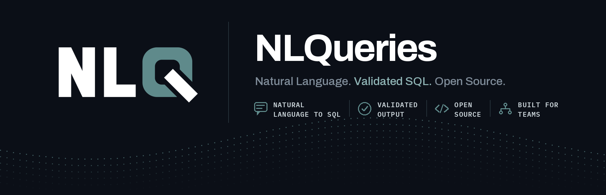

<p align="center">
  
</p>

# nlqueries-core

[](https://github.com/nlqueries/nlqueries/actions/workflows/ci.yml)
[](https://pypi.org/project/nlqueries-core/)
[](https://pypi.org/project/nlqueries-core/)
[](LICENSE)
[](https://github.com/nlqueries/nlqueries)

**NLQueries Core** turns plain-English questions into validated SQL, builds a self-updating YAML knowledge base from your schema and query history, and exposes everything as an MCP server your AI assistant can call directly. It also answers questions from your documents (PDF, Word, Excel, Notion, Confluence) and can blend both in a single hybrid answer.

**Website & docs:** [nlqueries.com](https://nlqueries.com)

---

## Features

| Capability | Description |
|---|---|
| **Database connectors** | PostgreSQL, MySQL, Snowflake, BigQuery, Redshift, SQL Server / Azure SQL, DuckDB, SQLite — plus a generic SQLAlchemy connector for any other SQLAlchemy-reachable database, driven by a connection URL |
| **Document connectors** | PDF, Word, Excel, Notion, Confluence — ask questions over ingested documents with citations |
| **Query pipeline** | Filter, cluster, and parameterize query history into reusable `QueryCapsule` templates |
| **Knowledge base** | Auto-generated YAML schema + capsule file, with coverage reporting via `kb-stats` |
| **Multi-agent orchestration** | Routes each question to a SQL agent, document agent, or both in parallel (hybrid) |
| **Conversational follow-ups** | Carries context across questions so a follow-up like "and by region?" resolves against the previous query — on by default in `nlqueries query`, reset with `--new-session` |
| **Semantic cache** | Returns previously-answered similar questions in under 50 ms, no LLM or DB round-trip |
| **Embedding daemon** | Keeps the embedding model resident in memory — ~10 ms per call instead of ~9 s |
| **LLM client** | Anthropic, OpenAI, or any LiteLLM-supported provider |
| **MCP server** | Query execution and schema/knowledge lookup exposed as MCP tools for Claude, Cursor, etc. |
| **CLI** | `nlqueries` (or the shorter `nlq` alias) — connect, build, query, and inspect from your terminal |

See [docs/architecture.md](docs/architecture.md) for how these pieces fit together.

---

## Quickstart

**Prerequisite:** Python 3.11+.

### Option A — Docker (recommended)

Pulls the published [`nlqueries/core`](https://hub.docker.com/r/nlqueries/core) image from Docker Hub — no clone required, just the compose file:

```bash
curl -O https://raw.githubusercontent.com/nlqueries/nlqueries/main/docker-compose.yml
```

Create a `.env` file next to it with at least one LLM key:

```bash
ANTHROPIC_API_KEY=sk-ant-...
# or OPENAI_API_KEY=sk-...
```

Then start the stack:

```bash
docker compose up
```

This pulls `nlqueries/core:latest` and starts it alongside Qdrant (`:6333`), with the MCP server on `:8080`. Run CLI commands against the running stack from a second terminal:

```bash
docker exec -it nlqueries-core nlqueries health
```

### Option B — pip install

```bash
pip install nlqueries-core
export ANTHROPIC_API_KEY=sk-ant-...   # or OPENAI_API_KEY
nlqueries health
```

Optional extras for specific connectors:

```bash
pip install "nlqueries-core[mysql]"     # MySQL
pip install "nlqueries-core[redshift]"  # Amazon Redshift
pip install "nlqueries-core[mssql]"     # SQL Server / Azure SQL
pip install "nlqueries-core[duckdb]"    # DuckDB
pip install "nlqueries-core[docs]"      # PDF / Word / Excel ingestion
pip install "nlqueries-core[wiki]"      # Notion / Confluence sync
```

### Option C — Clone and install from source

No Docker required — for contributing, or to run against unreleased changes:

```bash
git clone https://github.com/nlqueries/nlqueries.git
cd nlqueries
python -m venv .venv && source .venv/bin/activate   # Windows: .venv\Scripts\Activate.ps1
pip install -e ".[dev]"
export ANTHROPIC_API_KEY=sk-ant-...   # or OPENAI_API_KEY
nlqueries health
```

See [CONTRIBUTING.md](CONTRIBUTING.md#development-setup) for linting and test commands.

### First query

```bash
nlqueries connect postgres --host localhost --database mydb --user alice --password secret --alias dev
nlqueries process-history dev --days 30 --annotate
nlqueries export-kb dev
nlqueries query dev "How many orders shipped last month?"
nlqueries query dev "and how many were returned?"   # follow-up — keeps prior context
```

Follow-up context is on by default; pass `--new-session` to start fresh or
`--no-session` to disable it for a one-off question.

Full walkthrough: [docs/getting-started.md](docs/getting-started.md).

---

## Documentation

| Doc | Covers |
|---|---|
| [docs/getting-started.md](docs/getting-started.md) | Step-by-step setup and your first query |
| [docs/cli-reference.md](docs/cli-reference.md) | Every command and flag |
| [docs/connectors.md](docs/connectors.md) | Database and document connector setup, per-connector notes and caveats |
| [docs/configuration.md](docs/configuration.md) | Environment variables |
| [docs/troubleshooting.md](docs/troubleshooting.md) | Common warnings and errors explained |
| [docs/qdrant-setup.md](docs/qdrant-setup.md) | Setting up Qdrant (required for embeddings, semantic cache, document search) |
| [docs/mcp-authentication.md](docs/mcp-authentication.md) | Authenticating the MCP server — required to serve it over a network |
| [docs/architecture.md](docs/architecture.md) | Module layout and request flow |

---

## Contributing

See [CONTRIBUTING.md](CONTRIBUTING.md). All contributors must sign the CLA before a PR can be merged — see [CONTRIBUTOR_LICENSE_AGREEMENT.md](CONTRIBUTOR_LICENSE_AGREEMENT.md).

---

## License

[Business Source License 1.1](LICENSE) — each release converts to Apache 2.0 four years after its release date.
