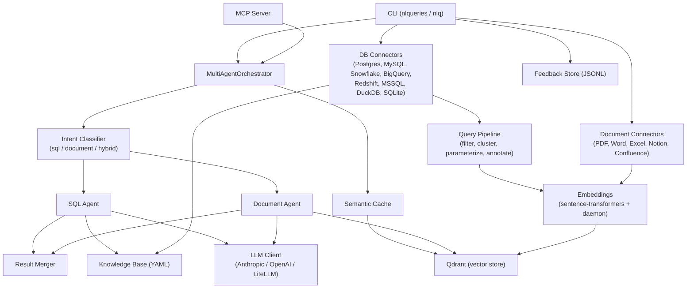

# Architecture

## Request flow



A question enters through the CLI or the MCP server and reaches the `MultiAgentOrchestrator`. The orchestrator first checks the semantic cache; on a miss, an intent classifier routes the question to the SQL agent, the document agent, or both in parallel (hybrid), and a result merger combines and ranks the outputs by confidence before returning an answer.

## Module layout

```
nlqueries/
├── cli/                 CLI commands (click + rich) — connect, query, ask, health, kb-stats, etc.
├── connectors/           DB connector implementations + BaseConnector ABC
│   ├── postgres.py, mysql (via base), snowflake.py, bigquery.py
│   └── redshift.py, mssql.py, duckdb.py        (optional extras)
├── document_connectors/  PDF, Word, Excel, Notion, Confluence + BaseConnector ABC
├── processing/           Query filter, clusterer, parameterizer, intent annotator, pipeline
├── knowledge/            YAML knowledge base generator (kb_generator.py) + kb-stats report (kb_stats.py)
├── embeddings/           Sentence-transformer embedder, Qdrant store, embedding daemon (embed_server.py)
├── cache/                Semantic cache (semantic_cache.py)
├── llm/                  LLM client abstraction — Anthropic, generic client, LiteLLM
├── orchestrator/         Orchestrator, intent classifier, multi-agent + document orchestrators,
│                         prompt assembly, SQL generation + sqlglot validation, result merger,
│                         conversation / follow-up handling
├── analysis/             Query analyzer
├── auth/                 OIDC token verification utilities
├── feedback/             Local JSONL feedback store + models
├── mcp_server/           MCP server entry point
├── telemetry.py          OpenTelemetry integration
└── config.py             Environment-variable configuration
```

See [cli-reference.md](cli-reference.md) for what each CLI command does, [connectors.md](connectors.md) for connector-specific behavior, and [configuration.md](configuration.md) for the environment variables that wire these modules together.
