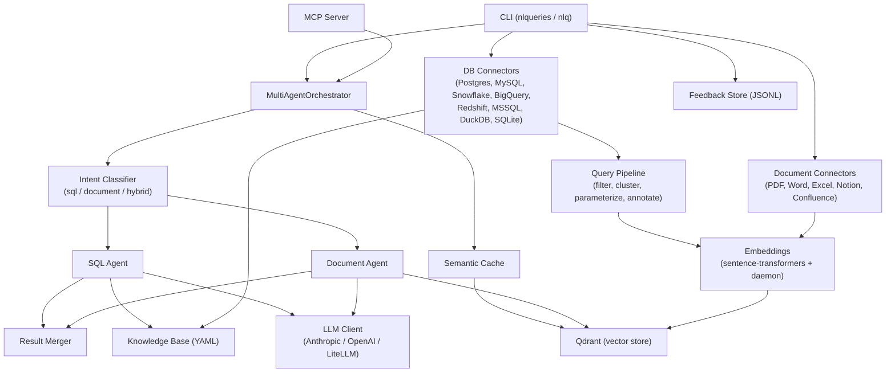

# Architecture

## Request flow



A question enters through the CLI or the MCP server and reaches the `MultiAgentOrchestrator`. The orchestrator first checks the semantic cache; on a miss, an intent classifier routes the question to the SQL agent, the document agent, or both in parallel (hybrid), and a result merger combines and ranks the outputs by confidence before returning an answer.

## Module layout

```
nlqueries/
├── cli/                 CLI commands (click + rich) — connect, query, ask, health, kb-stats, etc.
├── connectors/           DB connector implementations + BaseConnector ABC
│   ├── postgres.py, mysql (via base), snowflake.py, bigquery.py
│   └── redshift.py, mssql.py, duckdb.py        (optional extras)
├── document_connectors/  PDF, Word, Excel, Notion, Confluence + BaseConnector ABC
├── processing/           Query filter, clusterer, parameterizer, intent annotator, pipeline
├── knowledge/            YAML knowledge base generator (kb_generator.py) + kb-stats report (kb_stats.py)
├── embeddings/           Sentence-transformer embedder, Qdrant store, embedding daemon (embed_server.py)
├── cache/                Semantic cache (semantic_cache.py)
├── llm/                  LLM client abstraction — Anthropic, generic client, LiteLLM
├── orchestrator/         Orchestrator, intent classifier, multi-agent + document orchestrators,
│                         prompt assembly, SQL generation + sqlglot validation, result merger,
│                         conversation / follow-up handling
├── analysis/             Query analyzer
├── auth/                 OIDC token verification utilities
├── feedback/             Local JSONL feedback store + models
├── mcp_server/           MCP server entry point
├── telemetry.py          OpenTelemetry integration
└── config.py             Environment-variable configuration
```

## Cache partitioning and authorisation

The semantic cache is partitioned by agent: one Qdrant collection per agent,
named `cache_{agent_id}`. **Every entry in a collection is readable by everyone
who may query that agent.** That is not a gap in the model, it is a restatement
of it -- authorisation is granted at agent level, row filters are a property of
the agent record rather than of the caller, and cached SQL is replayed through
the same filtered connector that produced it, so a replay is subject to the
filters a fresh run would be. Document answers are cached verbatim, and every
user of the agent is entitled to the same documents.

That reasoning holds only as long as nothing narrows what a caller may see
*below* the agent. The invariant to preserve:

> Anything that makes two callers of the same agent entitled to different
> results -- per-user row filters, per-user document ACLs, row-level security
> keyed on caller identity, per-user column masking -- must contribute its
> distinguishing value to `cache_context` on **both** `get()` and `put()`.
> If it cannot, it must not be built.

`cache_context` (seam S2) is stored in the entry payload on write and compared
on read. The comparison is an **equality**, not a subset test: a caller that
passes no context reads only entries written with none. That direction matters
more than it looks. The failure being guarded against is a caller that forgets
to pass its context on one `get()` path, and under a subset test that caller
would have matched entries scoped by every context -- failing open, silently,
in exactly the case the mechanism exists for.

The context is recovered from the payload as whatever keys the cache did not
write itself (`_RESERVED_PAYLOAD_KEYS` in `cache/semantic_cache.py`), so there
is no marker field to keep in sync and entries written before the check existed
are still read correctly. A consequence worth knowing: **adding a new key to a
stored payload without adding it to that set makes it count as caller context,
and every entry carrying it will miss.**

**The context is covered by the signature.** `envelope.py` protects a cache
entry against anyone with write access to Qdrant but no access to the signing
key. Until the context was part of the signed message, that protection stopped
at the partition: reaching another context did not require forging a tag, only
moving a valid one, by editing the context keys the HMAC did not cover. The
context is now appended to the signed message -- but only when it is non-empty,
so an entry written without one produces byte-identical output to before and
keeps verifying. Only context-carrying entries pay a one-off miss on upgrade,
rather than the whole cache going cold. Conditional inclusion is still sound
both ways: stripping a context makes the verifier build the short message
against a tag computed over the long one, and adding a context does the reverse.

**The point ID carries the context too.** `put()` used to derive point IDs from
the question alone (`_point_id_for_question(normalized)`, and `tmpl:{masked}` for
the template point), so two callers in different contexts asking the same
question upserted over one another. That is not a future problem: `cache_context`
is already in use for follow-up turns, so a scoped follow-up write and a
context-free write of the same normalised question collided. The partition still
held -- neither read the other's entry -- but each clobbered the other and both
then missed indefinitely, which is a collapsed hit rate rather than a leak and
correspondingly harder to attribute. The context is now part of the id, appended
only when non-empty so entries written without one keep the id they had.

**The collection is swept on write, because the point ID no longer bounds it.**
Nothing else deletes: the TTL is applied on *read*, in `_payload_to_entry`, and
`invalidate()` drops the whole collection. That was survivable while a repeated
question upserted over its own id, since the point count then tracked an agent's
distinct question vocabulary. Once the id carried the cache context it stopped
being true -- enterprise derives `context_fingerprint` from the conversation
summary, the last SQL and a window of turns, so it changes on virtually every
follow-up turn, and each turn wrote points at an id that never recurs, was never
overwritten and was never removed.

`_prune_expired` deletes points past the TTL, at most once per collection per
`NLQ_CACHE_PRUNE_INTERVAL_SECONDS` (default one hour; `0` disables it), after the
upsert so a failed sweep cannot cost the caller the write that prompted it. The
cutoff is the same `ttl_hours` the read path applies, so it can only remove what
a read would already have discarded -- it cannot delete a servable entry.

Two things this also fixes, which were true before the id change and simply less
visible: expired points were still *ranked* by the vector search, since the TTL
is checked afterwards, so they consumed the candidate slots described below; and
scoped entries written before the id change are orphaned under ids nothing will
look up, so only an age-based sweep can ever reclaim them.

That the filter behaves correctly is established against a real Qdrant in
`tests/integration/test_cache_prune_integration.py`, not inferred. `created_at`
is an ISO string; a `DatetimeRange` that needed a datetime index it did not have
would either match nothing or -- far worse -- match everything, and the
difference between those is a cache that grows and a cache that is gone. It was
measured on v1.9.3 and v1.18.2 and holds indexed, keyword-indexed and unindexed
alike: correctness never depended on the index. `docker-compose.yml` now pins
v1.12.4 and enterprise pins v1.18.2 -- v1.9.3 predates the `query_points` API
every search here goes through, so it was never a version this project could run
against, only one it used to ship.

Speed does, which is why the sweep is issued with `wait=False` and `created_at`
is now indexed **as a datetime**. `ensure_collection`'s `payload_indexes`
creates *keyword* indexes, which do nothing for a range query over a timestamp,
so it grew a `datetime_indexes` argument rather than accepting an index that
would have looked like a fix. Collections created before this keep their
unindexed field and are swept by a scan; because the request does not wait, that
scan is Qdrant's problem rather than the caller's.

**What the candidate window bounds rather than eliminates.**
`NLQ_CACHE_COSINE_CANDIDATES` defaults to five. A context-free read on an agent
carrying more than five near-duplicate scoped entries, all above the threshold
and all ranked above the unscoped one, still falls through to a miss.

**Giving each context its own point ID makes that more likely, not less**, and
the two changes have to be read together. Scoped entries for one question used
to collapse onto a single point; they now accumulate one per context, so a busy
conversational agent can carry well past five follow-up-scoped entries for a
popular question, and from then on a context-free Tier 1 or Tier 2 lookup for it
is starved. Tier 0 hides this for a verbatim repeat but not for a paraphrase --
which is what tiers 1 and 2 exist for. Raising the setting is the immediate
answer, and the trade is payload transfer for candidates that are discarded.

The change that would remove it rather than bound it: store a digest of the
context as its own payload key, so the equality becomes an exact match Qdrant
*can* express, push it into the query filter and return the window to one. It is
not done here because every entry already stored lacks that key, so either the
whole cache goes cold for a TTL or the filter needs an `IsEmpty`-or-match
disjunction to keep matching them — worth doing deliberately rather than as the
tail of this change.

**Why the cosine tiers fetch more than one candidate.** Qdrant's filter is a
subset test: it can require the caller's keys but cannot require the absence of
others, so the equality is applied after the search rather than pushed into it.
Asking for a single point would therefore let the nearest neighbour decide the
outcome for everybody -- an entry from another context, ranked top, would consume
the only candidate slot and the lookup would fall through even with a
same-context entry immediately below it and above the threshold. That bites
hardest on context-free reads, where the pushed-down filter is `kind` alone and
every context-scoped entry competes freely for that slot. Both tiers take the
first candidate clearing the threshold *and* the context, and stop scanning at
the first below-threshold point so widening the window cannot lower the
similarity bar.

The invariant is guarded by `tests/test_cache_partitioning.py`, which asserts
across all three tiers that an entry written under one context is a miss for a
different context and for no context, and -- as the control that gives those
their meaning -- a hit for its own.

See [cli-reference.md](cli-reference.md) for what each CLI command does, [connectors.md](connectors.md) for connector-specific behavior, and [configuration.md](configuration.md) for the environment variables that wire these modules together.
